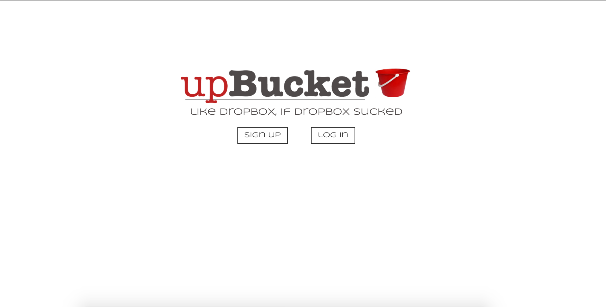
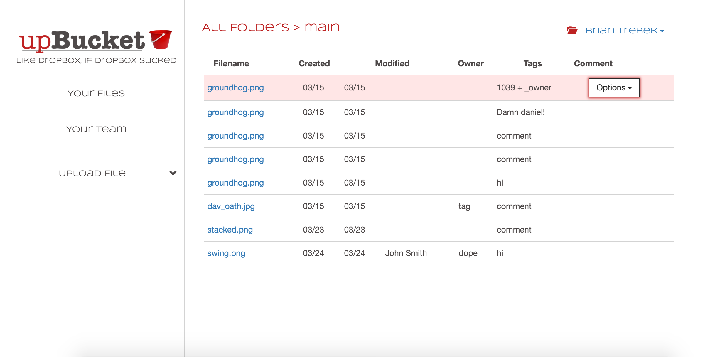

# upBucket API

## Hosted on Heroku

View app/API here: 
  [upBucket Client](http://apalmer0.github.io/upbucket-client/index.html)
   
  [upBucket API](https://pacific-chamber-64011.herokuapp.com)

## About

A basic file-storage system that allows users to save and retrieve
files from Amazon Web
Services. It's a lot like Dropbox, but different... mostly because of the
name.

This project was an exciting challenge requiring me
to gain comfort with a suite of new technologies in
order to deliver a specific project using a
specific stack. For example, learning how to use Mongoose to create
file owners was an interesting and
new challenge that I hadn't dealt with before.
Understanding the process of
uploading to Amazon Web Services was especially difficult
as I had never really previously used AWS,
so completing this project forced me to really get into
the details to make it work. That said, I wasn't able
to understand how to allow users to delete
from my AWS bucket, which means that when items are deleted from the app, they
still persist in AWS.

Things I would do with more time:

-   Delete files from AWS when they're deleted in the app

## Front End Mockups

The basic layout of the site was decided early on - unlike my other projects,
I wanted this interface to be extremely clean and minimalistic, with few if any
items to interact with besides the main calls to action.

User login screen:

Main interface:

## Screenshots

Generally speaking, the final version of the app was true to the mockup, which
mapped out the user flow from login to the main/only page of the app.

User login screen:

Main interface:

## Code

-   This app is written using Express, Node, and Mongodb.
